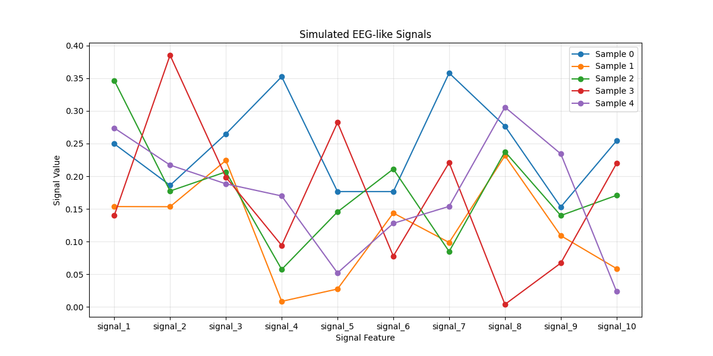
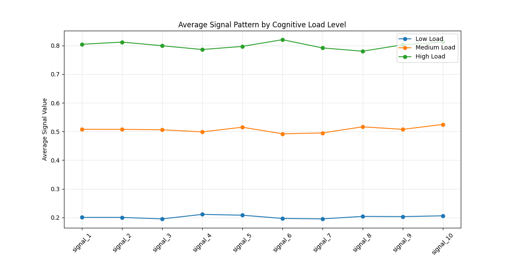
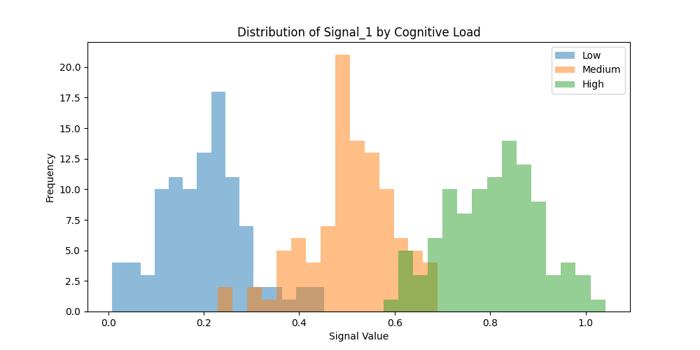
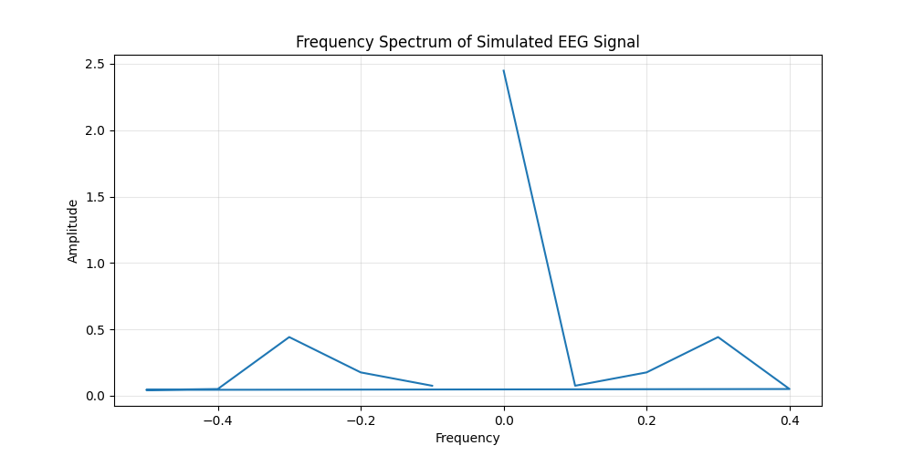
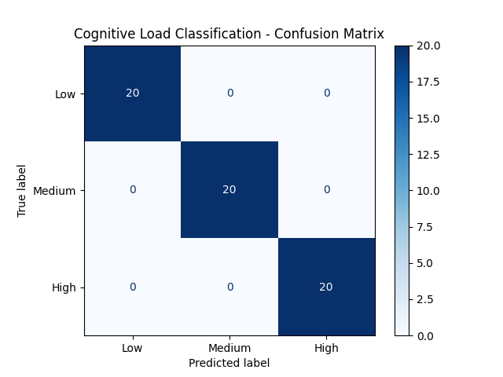

# Neuro AI Experiments

Exploring the intersection of artificial intelligence, neuroscience, and human cognition.

This repository contains experiments and prototypes that apply machine learning techniques to simulated EEG-like brain signal data.

The goal is to explore how AI models can help analyze neural patterns and detect cognitive states.

## Goals

- Explore how AI can help analyze brain-related data
- Experiment with cognitive load detection
- Visualize neural signal patterns
- Build small NeuroAI-inspired experiments

## Project Structure

data/
Sample EEG-like dataset

notebooks/
Exploratory analysis and experimentation

src/
Core scripts for preprocessing, training models, and predictions

visualizations/
Plots generated during analysis

app.py
Interactive Streamlit dashboard for exploring signals

## Technologies

Python  
NumPy  
Pandas  
Matplotlib  
Scikit-learn  

# First Experiment

**Cognitive Load Detection using Simulated EEG Signals**

This experiment simulates EEG-like neural signals and trains a machine learning model to classify cognitive load levels.

Pipeline:

1. Simulate neural signal features  
2. Visualize signal patterns  
3. Extract frequency features (FFT)  
4. Train a Random Forest classifier  
5. Evaluate model performance  

Notebook:
notebooks/cognitive_load_analysis(2).ipynb

## Results
# Signal Visualizations
### Simulated EEG Signal Patterns

### Average Signal Pattern by Cognitive Load

### Signal Distribution

# Frequency Analysis
### Frequency Spectrum (FFT)

# Model Evaluation

### Confusion Matrix

The model successfully classifies simulated cognitive load levels using signal features and frequency-domain features.

## Interactive Demo

This repository also includes a small Streamlit dashboard for exploring simulated EEG-like signals and cognitive load levels.

Run locally:

`pip install -r requirements.txt`

`streamlit run app.py`

## Features

- Simulated EEG-like signal generation
- Cognitive load class exploration
- Interactive sample visualization
- Average signal pattern comparison
- NeuroAI-inspired experiment workflow
  
## Future Work

- EEG signal analysis
- Cognitive load classification
- Brain signal visualization
- Brain-computer interface experiments

## Author

Ana Ixchel Pérez Amezcua  
AI & HealthTech Engineer interested in neuroscience and human cognition
